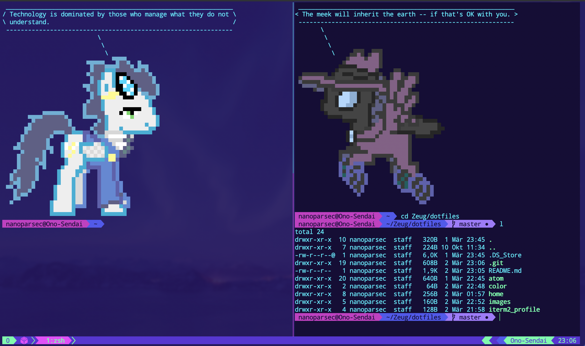
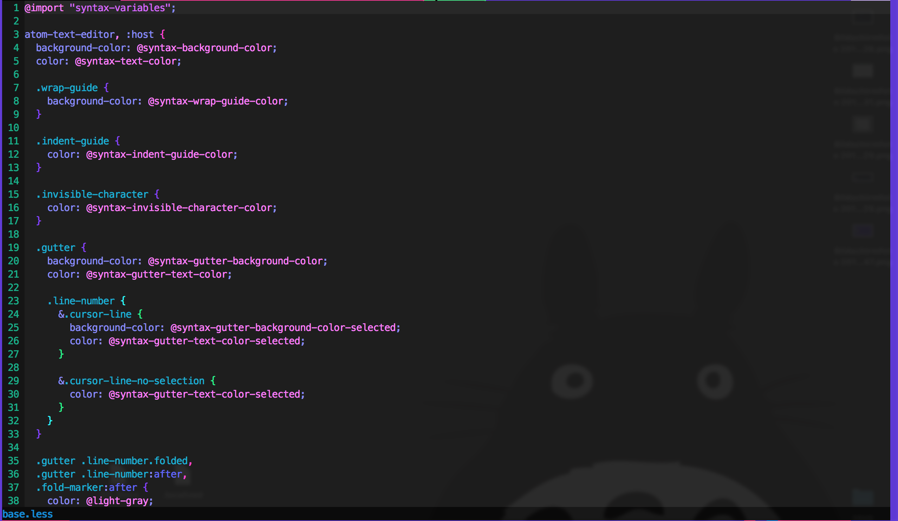
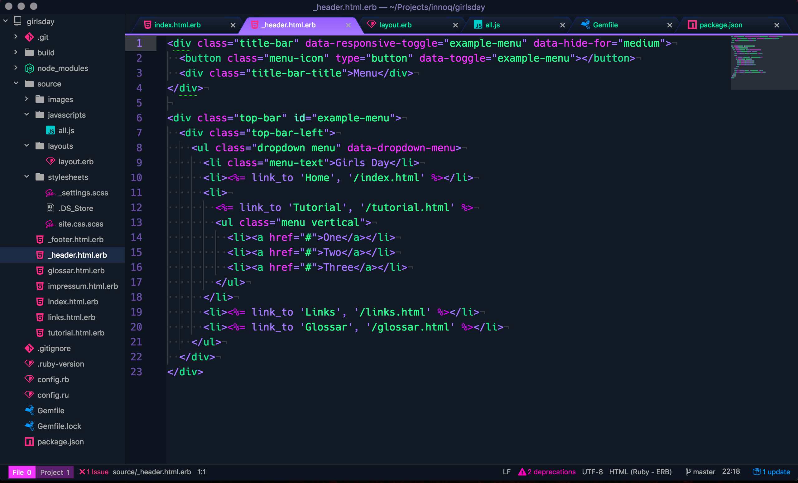

# Nanoparsec's dotfiles

These are my dotfiles.

My setup so far: 
- [iTerm2](iterm2)
- [Oh my Zsh](oh-my-zsh)
- [tmux](tmux)
- [Ponysay](ponysay)
- [Vim](vim)
- [Atom Editor](atom-editor)

## Terminal setup

I prefer working in a development environement, that matches my favorite colours. Since I like purple, pink and green, I was not able to find themes that I liked. SO I had to write them by myself.

### iTerm2
[iTerm2](https://www.iterm2.com/) is a terminal replacement for Mac.

You can find my colour settings and my iTerm profile [here](https://github.com/nanoparsec/dotfiles/blob/master/iterm2_profile/)

### Oh my Zsh
I am using a standard configuration of [Oh my Zsh](http://ohmyz.sh/) with the [Agnoster theme](https://github.com/agnoster/agnoster-zsh-theme) and [Droid Sans Mono from Nerd Fonts](https://nerdfonts.com/) with extra powerline glyphs as font.

### Tmux
I like to play around with the tmux status bar. You can find my tmux config [here](https://github.com/nanoparsec/dotfiles/blob/master/home/tmux.conf)

### Ponysay
Everytime I start a new terminal window a cute little pony appears. Wanna have it, too? Look [here](https://github.com/erkin/ponysay).

### Vim
I don't use Vim that often (trying out Emacs is on my bucket list), but as you can see, I am into colors. I am using a basic confoguration of vim including rainbow paranthesis.

### Atom Editor
My favorite editor is Atom. My configuration is very simple including linters and basic helpful settings. I also wrote my own color scheme inspired by My little Pony Twilightsparkle. 
So, if you want to have the same color experience, install [twilightsparkle-ui](https://atom.io/themes/twilightsparkle-ui) and [twilightsparkle-syntax](https://atom.io/themes/twilightsparkle-syntax) together with the [file icons package](https://atom.io/packages/file-icons)

